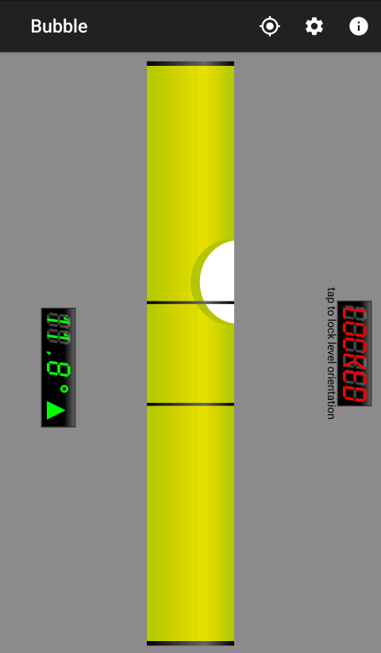
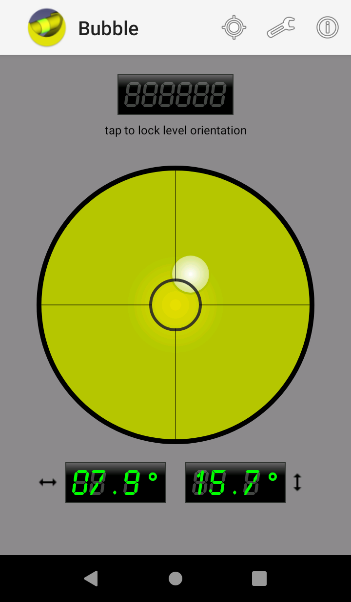
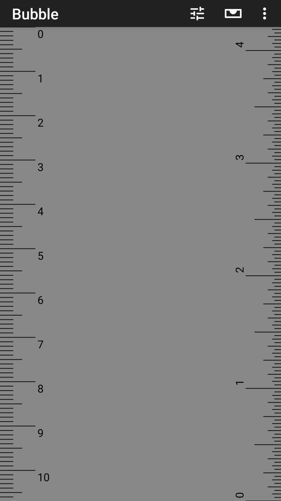

<pre>Send a coffee to woheller69@t-online.de
<a href= "https://www.paypal.com/signin"></a></pre>


| **RadarWeather** | **Gas Prices** | **Smart Eggtimer** |
|:---:|:---:|:---:|
| [](https://f-droid.org/packages/org.woheller69.weather/)| [](https://f-droid.org/packages/org.woheller69.spritpreise/) | [](https://f-droid.org/packages/org.woheller69.eggtimer/) |
| **Bubble** | **hEARtest** | **GPS Cockpit** |
| [](https://f-droid.org/packages/org.woheller69.level/) | [](https://f-droid.org/packages/org.woheller69.audiometry/) | [](https://f-droid.org/packages/org.woheller69.gpscockpit/) |
| **Audio Analyzer** | **LavSeeker** | **TimeLapseCam** |
| [](https://f-droid.org/packages/org.woheller69.audio_analyzer_for_android/) |[](https://f-droid.org/packages/org.woheller69.lavatories/) | [](https://f-droid.org/packages/org.woheller69.TimeLapseCam/) |
| **Arity** | **Cirrus** | **solXpect** |
| [](https://f-droid.org/packages/org.woheller69.arity/) | [](https://f-droid.org/packages/org.woheller69.omweather/) | [](https://f-droid.org/packages/org.woheller69.solxpect/) |
| **gptAssist** | **dumpSeeker** | **huggingAssist** |
| [](https://f-droid.org/packages/org.woheller69.gptassist/) | [](https://f-droid.org/packages/org.woheller69.dumpseeker/) | [](https://f-droid.org/packages/org.woheller69.hugassist/) |
| **FREE Browser** | | |
| [](https://f-droid.org/packages/org.woheller69.browser/) | | |

# Bubble: Spirit level and ruler

  

With Bubble you can measure angles and inclination.

Simply align one of your phone's four sides with an object or place it on a level surface to determine its orientation.

A ruler in cm and inches is also available.

Experience a user-friendly and ad-free solution with no permissions required.

[](https://f-droid.org/packages/org.woheller69.level/)

This is an updated fork of https://f-droid.org/packages/net.androgames.level/ which has not been revised since 2014.

## License

RulerView taken from https://github.com/SecUSo/privacy-friendly-ruler, published under GPL3.0 license

```
An Android Bubble Level application.

Copyright (C) 2014  Antoine Vianey
Copyright (C) 2021- woheller69

This program is free software: you can redistribute it and/or modify
it under the terms of the GNU General Public License as published by
the Free Software Foundation, either version 3 of the License, or
(at your option) any later version.

Level is distributed in the hope that it will be useful,
but WITHOUT ANY WARRANTY; without even the implied warranty of
MERCHANTABILITY or FITNESS FOR A PARTICULAR PURPOSE.  See the
GNU General Public License for more details.

You should have received a copy of the GNU General Public License
along with Level. If not, see <http://www.gnu.org/licenses/>
```
